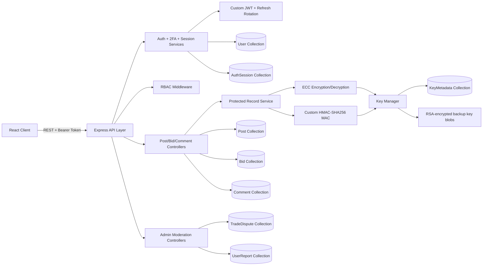

# Phase 7 Architecture Diagram

```mermaid
flowchart LR
    UI[React Client] -->|REST + Bearer Token| API[Express API Layer]
    API --> AUTH[Auth + 2FA + Session Services]
    API --> RBAC[RBAC Middleware]
    API --> MARKET[Post/Bid/Comment Controllers]
    API --> ADMIN[Admin Moderation Controllers]

    MARKET --> ENC[Protected Record Service]
    AUTH --> TOKEN[Custom JWT + Refresh Rotation]

    ENC --> ECC[ECC Encryption/Decryption]
    ENC --> HMAC[Custom HMAC-SHA256 MAC]

    ECC --> KEYMGR[Key Manager]
    HMAC --> KEYMGR

    KEYMGR --> KMD[(KeyMetadata Collection)]
    MARKET --> POSTS[(Post Collection)]
    MARKET --> BIDS[(Bid Collection)]
    MARKET --> COMMENTS[(Comment Collection)]
    AUTH --> USERS[(User Collection)]
    AUTH --> SESS[(AuthSession Collection)]
    ADMIN --> DISPUTES[(TradeDispute Collection)]
    ADMIN --> REPORTS[(UserReport Collection)]

    KEYMGR --> BACKUP[RSA-encrypted backup key blobs]
```
