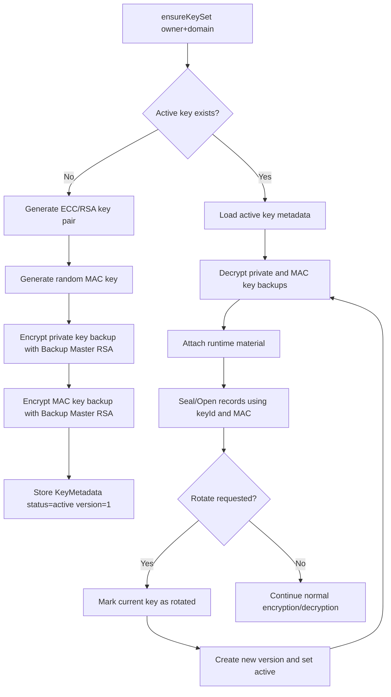

# Phase 7 Key Lifecycle Diagram

```mermaid
flowchart TD
    A[ensureKeySet owner+domain] --> B{Active key exists?}
    B -->|No| C[Generate ECC/RSA key pair]
    C --> D[Generate random MAC key]
    D --> E[Encrypt private key backup with Backup Master RSA]
    E --> F[Encrypt MAC key backup with Backup Master RSA]
    F --> G[Store KeyMetadata status=active version=1]

    B -->|Yes| H[Load active key metadata]
    H --> I[Decrypt private and MAC key backups]
    I --> J[Attach runtime material]

    J --> K[Seal/Open records using keyId and MAC]

    K --> L{Rotate requested?}
    L -->|Yes| M[Mark current key as rotated]
    M --> N[Create new version and set active]
    N --> I
    L -->|No| O[Continue normal encryption/decryption]
```
