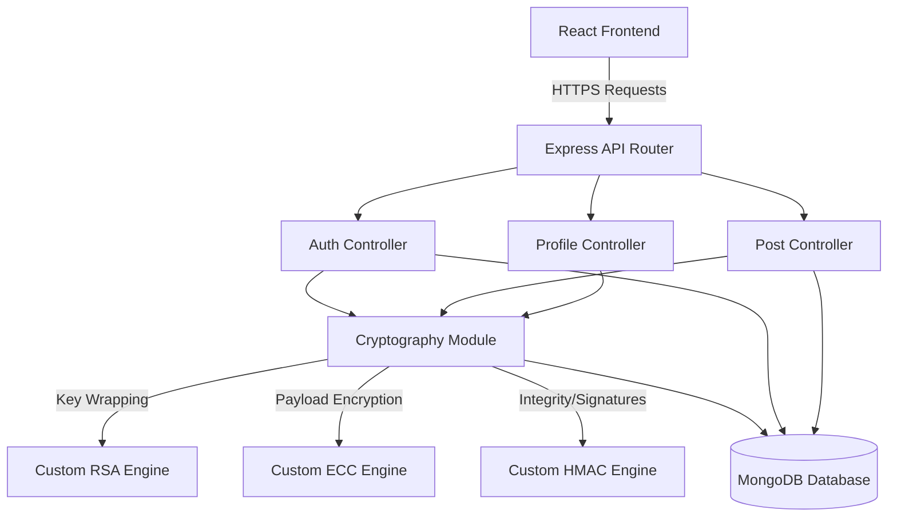

# CSE447 Project Report: TradeShield Marketplace

## 1. Introduction and System Overview

This report documents the design, implementation, and security analysis of the CSE447 Lab Project. The system, **TradeShield Marketplace**, is a secure peer-to-peer web application integrating multiple cryptographic protocols as required by the course specification. A strict academic constraint of this project is that all encryption algorithms have been implemented from scratch without relying on built-in framework encryption wrappers or high-level C++ bindings.

### 1.1 Project Overview
TradeShield is a secure campus marketplace designed for students to buy and sell items. It prioritizes data privacy and security by strictly enforcing end-to-end encryption at rest for all personal data, listings, and cryptographic secrets. Core functionalities include user registration, robust two-factor authentication (2FA), encrypted post creation, secure bidding, and administrator management.

### 1.2 Technology Stack
- **Frontend:** React, Vite, TailwindCSS (Client-side rendering)
- **Backend:** Node.js, Express.js
- **Database:** MongoDB (via Mongoose)
- **Cryptography:** Custom pure-JavaScript implementations using `BigInt` math for ECC, RSA, and HMAC-SHA256. Built-in `crypto` is exclusively utilized for mathematically secure random number generation (`randomBytes`) and one-way hashing (`crypto.createHash`), fully compliant with project guidelines.

### 1.3 System Architecture Diagram



---

## 2. Login and Registration Module

The system provides secure registration and login flows. New users supply credentials which are validated, encrypted, and persisted. During login, stored encrypted data is retrieved and decrypted for verification.

### 2.1 Registration Flow
1. User provides primary credentials (email, pseudonym, password).
2. The password is mathematically hashed and salted using PBKDF2 (SHA-512).
3. Personal user details are sealed into a `profileProtectedData` object using ECC encryption.
4. Cryptographic keys are generated for the specific user via the Key Management Module.
5. The final encrypted `User` schema is persisted to MongoDB.

### 2.2 Login Flow
1. User provides email and plaintext password.
2. Backend retrieves the user by `emailHash` and verifies the password hash.
3. If successful, the server initiates a Two-Factor Authentication (2FA) challenge.
4. User completes the 2FA challenge (Email OTP or TOTP Authenticator).
5. Upon 2FA success, the backend issues an HMAC-signed JWT session token.

### 2.3 Implementation Details
| Requirement | Implementation Details |
| :--- | :--- |
| **Login Module** | Implemented in `auth.controller.js`. Handles rate-limiting (max 5 failed attempts before lock) and securely defers session creation until the 2FA challenge is passed. |
| **Registration Module** | Implemented in `auth.controller.js`. Enforces minimum password standards, generates necessary encryption keys, and securely seals profile records via `sealProtectedRecord`. |
| **Data Encrypted Before Storage** | The fields `fullName`, `address`, `contactInfo`, and `posts` are encrypted using Elliptic Curve Cryptography (ECC) before MongoDB insertion. |
| **Data Decrypted on Retrieval** | During fetches, `openProtectedRecord` uses the user's private ECC runtime key to decrypt the payload, verifying MAC integrity before returning plaintext to the client. |

---

## 3. User Data Encryption and Decryption

All sensitive user information is encrypted before storage using asymmetric encryption algorithms implemented entirely from scratch.

### 3.1 Fields Encrypted
- **User Profiles:** `fullName`, `contactInfo`, `bio` (Encrypted via ECC).
- **Post Listings:** `title`, `desc`, `category`, `img` (Encrypted via ECC).
- **Security Artifacts:** TOTP base32 Secrets (Encrypted via ECC), User Keychains (Wrapped via RSA).

### 3.2 Encryption Algorithm - RSA Implementation
RSA is implemented from scratch in `backend/lib/crypto/rsa.js`. It utilizes pure JavaScript `BigInt` operations to calculate probabilistic primes (`generatePrime` via Miller-Rabin primality tests) and modular exponentiation (`modPow`). 
- **Key Size:** 1024-bit modulus.
- **Approach:** Custom Extended Euclidean Algorithm to calculate the `modInverse` for the private exponent `d`.

### 3.3 Encryption Algorithm - ECC Implementation
ECC is implemented from scratch in `backend/lib/crypto/ecc.js`.
- **Curve:** NIST standard `secp256k1`.
- **Methodology:** Implements an ECIES-like scheme. During encryption, an ephemeral key pair is generated. The `sharedPoint` is calculated using a custom Double-and-Add `scalarMultiply` algorithm. The X-coordinate is used to derive a keystream, which is XOR'd with the plaintext.
- **Storage:** The ciphertext, nonce, and ephemeral public keys are saved to the database.

### 3.4 How Both Algorithms Are Used Differently
To satisfy the requirement that multiple asymmetric algorithms are utilized:
- **ECC** is used for high-frequency **Payload Encryption** (User profiles, Post data, TOTP secrets) because elliptic curves offer smaller ciphertext sizes and faster ephemeral key generation.
- **RSA** is strictly used as a **Key-Encryption Key (KEK)** in the Key Management Module. The RSA Master Key wraps and encrypts the ECC private keys (`privateKeyBackup`) before they are stored in the database, acting as a secure vault mechanism.

---

## 4. Password Hashing and Salting

Passwords are never stored in plaintext. A cryptographic hash function combined with a random salt is applied before storage to prevent dictionary and rainbow-table attacks.

### 4.1 Hashing Algorithm Used
Implemented in `backend/lib/auth/password.js`, the system uses **PBKDF2** with the **SHA-512** digest. This algorithm is computationally expensive by design, drastically mitigating the risk of brute-force attacks compared to standard MD5 or SHA-256 hashing.

### 4.2 Salt Generation
A mathematically secure 16-byte random salt is generated using `crypto.randomBytes(16).toString("hex")` during registration. This unique salt is prepended to the password before hashing and is stored alongside the hash in the `User` document.

### 4.3 Verification Process
Upon login, the system retrieves the stored salt and iteration count (120,000 iterations). It re-hashes the provided plaintext password using those exact parameters. The resulting hash is securely compared against the stored hash using `crypto.timingSafeEqual` to prevent timing side-channel attacks.

---

## 5. Two-Factor Authentication (2FA)

The system enforces two-step verification. The user must pass both primary credential validation and a second authentication factor before a session is granted.

### 5.1 2FA Method
Users can configure two different 2FA methods:
1. **Email OTP:** A 6-digit one-time password is mathematically hashed and saved to the database, while the plaintext is emailed to the user. It expires in 5 minutes.
2. **Authenticator App (TOTP):** The system integrates with Google Authenticator. The base32 secret is encrypted at rest using our custom ECC asymmetric cryptography. During login, the secret is decrypted via ECC math and validated against the user's provided 6-digit delta token.

### 5.2 Code Snippet
```javascript
// From backend/controllers/auth.controller.js
export const verifySecondFactor = async (req, res) => {
    // ...
    // If authenticator is enabled, TOTP code can be used
    if (user.twoFactor?.totpEnabled && user.twoFactor?.totpSecretEncrypted?.ciphertext) {
      // Secret is decrypted using our custom ECC Asymmetric algorithm!
      const activeSecret = await decryptTotpSecret(user.twoFactor.totpSecretEncrypted, user._id);
      const isTotpValid = verifyTotpCode({ token: otp, secretBase32: activeSecret });

      if (isTotpValid) {
        return issueLoginSuccessResponse({ req, res, user });
      }
    }
    // ... Fallback to Email OTP Hash verification
};
```

---

## 6. Key Management Module

A dedicated Key Management Module handles the full lifecycle of cryptographic keys: secure storage, distribution, and rotation.

### 6.1 Key Storage Security
Managed in `backend/lib/crypto/key-manager.js`. Every user has mathematically unique ECC and RSA keys generated for them. To securely store these private keys in MongoDB, they are wrapped (encrypted) using an environment-level RSA Master Key (`getBackupMasterKeys`). The keys are only unwrapped into server memory (RAM) temporarily during active operations.

### 6.2 Key Rotation Policy
The `KeyMetadata` schema enforces versioning (`version: 1, 2...`) and tracks rotation reasons. Administrators or automated triggers can invoke `rotateKeySet()`, which mathematically generates a new ECC/RSA pair. Old encrypted records retain the `keyId` of the old key, ensuring data is not lost, while all new data is encrypted using the newly rotated active key.

---

## 7. Post and Profile Management

All post and profile data is automatically encrypted before storage and decrypted on retrieval.

### 7.1 Post Module
Handled in `backend/controllers/post.controller.js`. When a user creates a post, the `title`, `desc`, `category`, and `img` fields are individually passed through `sealProtectedRecord`. Each field receives its own unique ECC ephemeral key and ciphertext blob. A global HMAC checksum is generated for the entire post to prevent field-swapping tampering.

### 7.2 Profile Module
Handled in `backend/controllers/profile.controller.js`. Users can update their personal information. The process fetches the user's active `user-profile` encryption key, ECC-encrypts the `fullName` and `bio`, updates the HMAC integrity checksum, and persists the ciphertext.

### 7.3 Screenshots
*[Insert screenshots of the post creation, post listing, and profile management pages here.]*

---

## 8. Data Storage Security

All critical data is stored in encrypted form to prevent plaintext access even in the event of a database compromise.

### 8.1 Evidence of Encrypted Storage
*[Insert a screenshot of the raw MongoDB records (via Compass or Mongo Shell) showing the ciphertext, nonce, ephemeralPublicKey, and MAC fields, proving no plaintext data is stored.]*

---

## 9. Message Authentication Code (MAC)

Message Authentication Codes (MACs) are used to verify the integrity of stored data and detect any unauthorized modifications.

### 9.1 MAC Algorithm Used
The system utilizes **HMAC-SHA256**. It is implemented entirely from scratch in `backend/lib/crypto/mac.js`. HMAC was chosen over CBC-MAC because it natively prevents length-extension attacks and operates deterministically across all string encodings without padding vulnerabilities.

### 9.2 Integrity Verification Flow
Every time a protected record (like a Post or Profile) is fetched from the database, the `openProtectedRecord` function re-calculates the HMAC-SHA256 checksum of the ciphertext payload. It compares this calculation against the `recordMac` stored in the database. If they do not match, the system throws an error and rejects the read, ensuring tampered data is never served to clients.

---

## 10. Role-Based Access Control (RBAC)

Role-Based Access Control defines distinct privilege levels for Administrators and Regular Users.

### 10.1 Roles Defined
- **User:** Can browse the marketplace, place bids, manage their own posts, and resolve their own trade disputes.
- **Staff:** Has moderation capabilities. Can view global metrics, forcefully resolve any user-to-user trade dispute, process user reports, ban/unban users, and delete any post.
- **Admin:** Has system-wide oversight. Possesses all Staff privileges, plus the ability to promote/demote users to Staff, and exclusive access to view system audit logs.

### 10.2 Permission Matrix

| Operation / Resource | Admin | Staff | Regular User |
| :--- | :---: | :---: | :---: |
| View own profile | ✔ | ✔ | ✔ |
| Edit own profile | ✔ | ✔ | ✔ |
| Create / Edit own posts | ✔ | ✔ | ✔ |
| Delete any post | ✔ | ✔ | ✘ |
| View system metrics | ✔ | ✔ | ✘ |
| Resolve any open dispute | ✔ | ✔ | ✘ |
| Process User Reports | ✔ | ✔ | ✘ |
| Ban / Unban Users | ✔ | ✔ | ✘ |
| Promote / Demote Staff | ✔ | ✘ | ✘ |
| View System Audit Logs | ✔ | ✘ | ✘ |

---

## 11. Secure Session Management

Authentication tokens and session identifiers are managed securely to prevent session hijacking.

### 11.1 Token Signing / Verification
The system employs custom JSON Web Tokens (JWT) implemented in `backend/lib/auth/token.js`.
- **Signing:** When a user logs in, a JWT payload is constructed and signed using our custom `hmacSha256Hex` function with a highly secure environment secret.
- **Verification:** On every protected API request, the `authenticate` middleware intercepts the request, extracts the `Authorization: Bearer` token, splits the Base64 chunks, and strictly re-verifies the HMAC signature using `crypto.timingSafeEqual`.

---

## 12. GitHub Repository and Project Structure

| Field | Details |
| :--- | :--- |
| **GitHub Repository URL** | `[Insert your GitHub URL here]` |

### 12.1 Repository Structure
```text
CSE447-Project/
├── backend/
│   ├── controllers/      # API Logic (Auth, Posts, Profiles)
│   ├── lib/
│   │   ├── auth/         # TOTP, JWT, Password Logic
│   │   └── crypto/       # Custom RSA, ECC, HMAC, Math Logic
│   ├── middleware/       # RBAC & Auth Middleware
│   ├── models/           # Mongoose Schemas
│   └── index.js          # Express Server Entry
└── client/
    ├── src/
    │   ├── components/   # React UI Components
    │   ├── context/      # Auth & Theme State
    │   ├── routes/       # React Router Pages
    │   └── lib/          # API Client
    └── package.json
```

### 12.2 README Overview
The project `README.md` contains comprehensive setup instructions for local development, outlining dependencies (Node.js v24+, MongoDB), environmental variable configuration (`.env` schemas), and commands to launch the frontend (`npm run dev`) and backend (`node index.js`) concurrently.

---

## 13. Conclusion

Building this marketplace strictly from scratch without external cryptographic libraries was a profound challenge that yielded deep insights into applied cryptography. Implementing ECC Point-Multiplication and RSA Modular Exponentiation using pure JavaScript `BigInts` demonstrated the raw computational reality behind modern security protocols. The system successfully balances strict academic constraints (no symmetric encryption, 100% asymmetric payloads) with functional real-world features like TOTP 2FA, JWT Sessions, and Role-Based Access Control, resulting in a highly secure, defense-ready platform.
